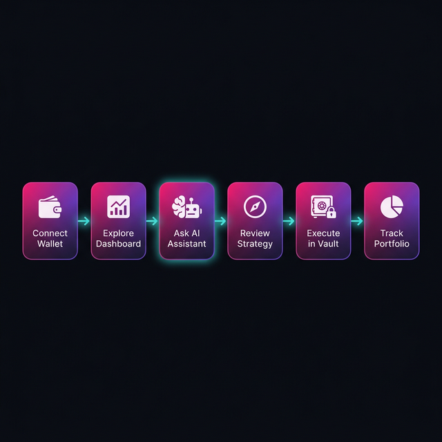
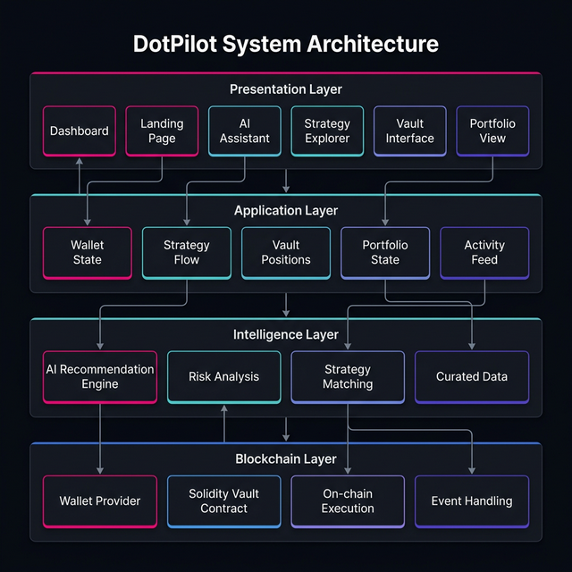
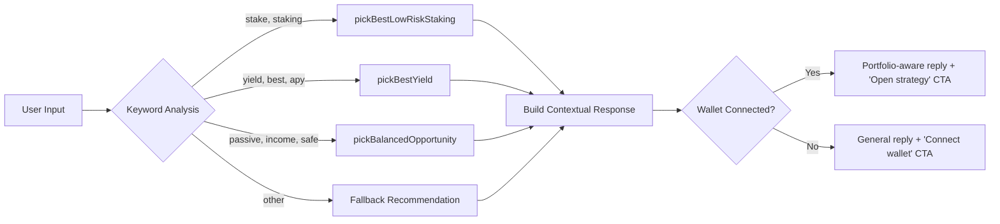

<p align="center">
  
</p>

<h1 align="center">DotPilot</h1>

<p align="center">
  <strong>AI-Powered DeFi Navigator for Polkadot Hub</strong>
</p>

<p align="center">
  <a href="#-overview">Overview</a> •
  <a href="#-key-features">Features</a> •
  <a href="#-demo-flow">Demo</a> •
  <a href="#-system-architecture">Architecture</a> •
  <a href="#-tech-stack">Tech Stack</a> •
  <a href="#-getting-started">Getting Started</a> •
  <a href="#-roadmap">Roadmap</a>
</p>

<p align="center">
  
  
  
</p>

<p align="center">
  
  
  
  
  
  
</p>

---

## 📖 Overview

**DotPilot** is an AI-powered DeFi navigation dapp built for the **Polkadot Solidity Hackathon** on [DoraHacks](https://dorahacks.io).

Instead of forcing users to jump between fragmented DeFi tools, DotPilot combines **strategy discovery**, **AI-guided recommendations**, and a **vault execution flow** into one polished product experience — all built on **Polkadot Hub** using EVM-compatible **Solidity smart contracts**.

### The Problem

DeFi users face significant barriers:

- 🔀 **Fragmented interfaces** across multiple protocols
- 🤷 **Unclear strategy selection** — which pool, which APY, which risk?
- 📉 **Difficulty understanding risk** without expert knowledge
- 🚫 **Weak guidance** for users new to the ecosystem

### The Solution

DotPilot provides **one guided flow**:

1. **Discover** curated DeFi opportunities in the Polkadot ecosystem
2. **Ask the AI assistant** for personalized strategy guidance
3. **Understand risk and yield** with clear explanations
4. **Execute through the vault** — deposit, withdraw, and track positions

This makes DeFi interactions easier to understand, easier to demo, and ready to evolve into a full production product.

---

## ✨ Key Features

<table>
  <tr>
    <td width="50%">

### 🔗 Wallet Integration
Connect via **MetaMask** or use the **Demo Wallet** for the hackathon flow. Wallet-required features stay locked until connection, providing clear progressive disclosure.

</td>
    <td width="50%">

### 🤖 AI DeFi Assistant
Ask questions like *"Where should I stake my DOT?"* and receive **grounded recommendations** tied to real strategies shown in the app. The assistant routes you directly into the vault flow.

</td>
  </tr>
  <tr>
    <td width="50%">

### 🏦 Smart Vault
Deposit and withdraw assets through a **Solidity-based vault contract**. The vault is the core execution layer — where intent becomes on-chain action.

</td>
    <td width="50%">

### 🧭 Strategy Explorer
Browse, search, filter, and sort **8 curated DeFi strategies** by APY, risk level, and protocol type. Each strategy links directly to the vault flow.

</td>
  </tr>
  <tr>
    <td width="50%">

### 📊 Portfolio Dashboard
Overview of wallet value, managed vault capital, claimable rewards, and average opportunity APY — complete with an interactive **portfolio momentum chart**.

</td>
    <td width="50%">

### 🎬 Animated Landing Experience
A premium **motion-heavy landing page** with 3D card stacks, orbit animations, flowing data particles, and a marquee feature showcase — built to impress at first glance.

</td>
  </tr>
</table>

### Additional Capabilities

| Feature | Description |
|---|---|
| 🔔 **Activity Feed** | Real-time notifications for wallet connections, deposits, and withdrawals |
| 🔒 **Progressive Wallet Gating** | Sidebar clearly shows locked features with unlock prompts |
| 📱 **Responsive Design** | Fully responsive from mobile to desktop with collapsible sidebar |
| 🎨 **Polkadot Branding** | Custom dark theme inspired by Polkadot's visual language |
| ⚡ **Single-File Build** | Production bundle as a single HTML file for maximum portability |

---

## 🎯 Demo Flow

<p align="center">
  
</p>

The intended hackathon demo follows this precise path:

```
Step 1 → User opens DotPilot and sees the animated landing page
Step 2 → User connects wallet (MetaMask or Demo Wallet)
Step 3 → Dashboard reveals portfolio overview + curated DeFi opportunities
Step 4 → User asks the AI assistant: "Where should I stake my DOT?"
Step 5 → Assistant recommends Bifrost Liquid Staking (16.1% APY, Low Risk)
Step 6 → User clicks "Open strategy" → navigates to the Vault page
Step 7 → User enters amount and confirms deposit
Step 8 → Portfolio updates with new position, activity feed logs the action
```

**Demo Promise:** After 3 minutes, a judge understands what DotPilot solves, why AI matters here, and why it belongs on Polkadot Hub.

---

## 🏗️ System Architecture

DotPilot is designed as a **four-layer architecture** that cleanly separates concerns and supports future scaling:

<p align="center">
  
</p>

### Layer Details

#### 1. Presentation Layer

The user-facing interface built with React and Tailwind CSS.

| Component | Responsibility |
|---|---|
| `LandingPage` | Animated entry experience for disconnected users |
| `Dashboard` | Portfolio overview, charts, and opportunity cards |
| `AIAssistant` | Chat interface with AI-grounded responses |
| `Strategies` | Filterable strategy explorer |
| `VaultPage` | Deposit, withdraw, and position management |
| `Portfolio` | Wallet allocation, managed positions, activity history |
| `Header` | Network status, notifications, wallet actions |
| `Sidebar` | Navigation with wallet-gated feature locks |
| `WalletModal` | MetaMask and demo wallet connection flow |

#### 2. Application Layer

Manages shared product state and flow orchestration.

```
┌─────────────────────────────────────────────────────────────┐
│                        App.tsx                               │
│                                                              │
│  ┌──────────┐ ┌────────────┐ ┌─────────────┐ ┌──────────┐  │
│  │ Wallet   │ │ Selected   │ │   Vault     │ │ Activity │  │
│  │ State    │ │ Strategy   │ │ Positions   │ │ Feed     │  │
│  │          │ │ Flow       │ │             │ │          │  │
│  └──────────┘ └────────────┘ └─────────────┘ └──────────┘  │
│                                                              │
│  ┌──────────────┐  ┌──────────────┐  ┌──────────────────┐  │
│  │  Deposit     │  │  Withdraw    │  │  Notifications   │  │
│  │  Handler     │  │  Handler     │  │  Generator       │  │
│  └──────────────┘  └──────────────┘  └──────────────────┘  │
└─────────────────────────────────────────────────────────────┘
```

Key responsibilities:

- **Wallet state** — connection, address, provider type
- **Strategy selection flow** — dashboard → assistant → vault handoff
- **Vault positions** — deposit/withdraw state mutations
- **Activity & notifications** — event-driven updates

#### 3. Intelligence Layer

Powers the AI recommendation engine with grounded, actionable outputs.

```
User Input ──► Keyword Analysis ──► Strategy Matching ──► Risk Context
                                          │
                                          ▼
                                   Curated Dataset
                                   (8 strategies)
                                          │
                                          ▼
                              Contextual Response Builder
                              ├── Portfolio-aware amounts
                              ├── Risk explanations
                              └── CTA with strategy routing
```

The AI assistant:
- Matches user intent through **keyword analysis** (staking, yield, passive income, risk)
- Selects the **best strategy** based on APY and risk profile
- Generates **portfolio-aware** recommendations when wallet is connected
- Provides a **direct CTA** that routes into the vault flow

#### 4. Blockchain Layer

Handles on-chain interactions via EVM-compatible smart contracts.

```
┌─────────────┐     ┌──────────────────┐     ┌────────────────┐
│   MetaMask  │────►│   Vault Contract │────►│  Polkadot Hub  │
│   Provider  │     │   (Solidity)     │     │  (EVM Chain)   │
└─────────────┘     │                  │     └────────────────┘
                    │  • deposit()     │
                    │  • withdraw()    │
                    │  • getPosition() │
                    │  • Events        │
                    └──────────────────┘
```

---

## 🔧 Tech Stack

### Frontend

| Technology | Version | Purpose |
|---|---|---|
| [React](https://react.dev) | 19.2.3 | Component-based UI library |
| [TypeScript](https://www.typescriptlang.org) | 5.9.3 | Type-safe development |
| [Vite](https://vite.dev) | 7.2.4 | Build tool and dev server |
| [Tailwind CSS](https://tailwindcss.com) | 4.1.17 | Utility-first styling |
| [Recharts](https://recharts.org) | 3.8.0 | Chart visualizations |
| [Lucide React](https://lucide.dev) | 0.577.0 | Icon system |
| [clsx](https://github.com/lukeed/clsx) | 2.1.1 | Conditional class names |
| [tailwind-merge](https://github.com/dcastil/tailwind-merge) | 3.4.0 | Tailwind class conflict resolution |

### Smart Contracts

| Technology | Purpose |
|---|---|
| Solidity `^0.8.x` | Smart contract language |
| OpenZeppelin Contracts | Security primitives (AccessControl, ReentrancyGuard, Pausable) |
| Polkadot Hub (EVM) | Deployment target |

### Development Tools

| Tool | Purpose |
|---|---|
| vite-plugin-singlefile | Bundle entire app into single HTML file |
| ESLint + TypeScript strict mode | Code quality enforcement |
| Git | Version control |

---

## 📂 Project Structure

```
dotpilot/
│
├── 📄 index.html                    # Entry HTML with meta tags
├── 📄 package.json                  # Dependencies and scripts
├── 📄 tsconfig.json                 # TypeScript configuration (strict mode)
├── 📄 vite.config.ts                # Vite + Tailwind + SingleFile plugin
├── 📄 .gitignore                    # Git ignore rules
│
├── 📘 PRD.md                        # Product Requirements Document
├── 📘 ROADMAP.md                    # Hackathon execution roadmap
├── 📘 README.md                     # This file
│
├── 📁 docs/
│   └── 📁 images/                   # Architecture diagrams and assets
│       ├── banner.png
│       ├── system-architecture.png
│       └── user-flow.png
│
├── 📁 dist/                         # Production build output
│   └── index.html                   # Single-file production bundle
│
└── 📁 src/                          # Application source code
    │
    ├── 📄 main.tsx                  # React DOM entry point
    ├── 📄 App.tsx                   # App orchestrator (shared state, routing)
    ├── 📄 types.ts                  # Shared TypeScript interfaces
    ├── 📄 index.css                 # Design system, themes, animations
    │
    ├── 📁 components/               # UI components
    │   ├── AIAssistant.tsx          # Chat interface + recommendation engine
    │   ├── Dashboard.tsx            # Portfolio dashboard + opportunity cards
    │   ├── Header.tsx               # Top bar (network, notifications, wallet)
    │   ├── LandingPage.tsx          # Animated landing experience
    │   ├── Portfolio.tsx            # Allocation, positions, activity
    │   ├── Sidebar.tsx              # Navigation with wallet gating
    │   ├── Strategies.tsx           # Filterable strategy explorer
    │   ├── VaultPage.tsx            # Deposit/withdraw execution flow
    │   └── WalletModal.tsx          # Wallet connection modal
    │
    ├── 📁 data/                     # Mock and curated data
    │   └── mockData.ts             # Tokens, strategies, history, AI templates
    │
    └── 📁 utils/                    # Reusable helper functions
        ├── cn.ts                    # clsx + tailwind-merge utility
        └── portfolio.ts             # Asset pricing, USD conversion, formatting
```

### Architecture Principles

- **Centralized state** — `App.tsx` owns wallet, strategy, vault, and activity state
- **Presentational components** — each page component focuses on rendering and user interaction
- **Explicit type contracts** — all shared models live in `types.ts`
- **Separated utilities** — calculation and formatting logic extracted to `utils/`
- **Clean blockchain boundary** — future contract logic integrates without touching UI components

---

## 📐 Data Models

### Core TypeScript Interfaces

```typescript
// Token held in the connected wallet
interface Token {
  symbol: string;       // "DOT", "GLMR", "ASTR"
  name: string;         // "Polkadot", "Moonbeam"
  balance: number;      // Current token balance
  value: number;        // USD equivalent
  change24h: number;    // 24h price change percentage
  icon: string;         // Display icon character
  color: string;        // Brand color hex code
}

// DeFi strategy opportunity
interface DefiOpportunity {
  id: string;
  protocol: string;     // "Polkadot Hub Staking", "Hydration DEX"
  type: 'Staking' | 'Yield Farming' | 'Liquidity Pool' | 'Lending';
  asset: string;        // "DOT", "DOT/USDT", "GLMR/DOT"
  apy: number;          // Annual percentage yield
  tvl: string;          // Total value locked display
  risk: 'Low' | 'Medium' | 'High';
  description: string;
  recommended: boolean; // AI-recommended flag
}

// Active vault position
interface VaultPosition {
  id: string;
  strategyId: string;   // Links to DefiOpportunity
  strategy: string;     // Protocol display name
  asset: string;
  baseAsset: string;    // Primary token symbol
  deposited: number;    // Original deposit amount
  currentValue: number; // Current position value
  apy: number;
  rewards: number;      // Accrued yield
  status: 'Active' | 'Pending' | 'Completed';
}

// Chat message in AI assistant
interface ChatMessage {
  id: string;
  role: 'user' | 'assistant';
  content: string;
  timestamp: Date;
  strategyId?: string;  // Linked strategy for CTA
  ctaLabel?: string;    // Action button text
}

// User activity log entry
interface ActivityItem {
  id: string;
  type: 'connect' | 'deposit' | 'withdraw' | 'assistant';
  title: string;
  description: string;
  asset?: string;
  amount?: number;
  timestamp: Date;
  status: 'Confirmed' | 'Pending';
}
```

---

## 🎨 Design System

DotPilot uses a custom **dark theme** inspired by the Polkadot visual identity.

### Color Palette

| Token | Hex | Usage |
|---|---|---|
| `dot-pink` | `#E6007A` | Primary brand, CTAs, active states |
| `dot-pink-dark` | `#C20066` | Hover states |
| `dot-pink-light` | `#FF2D9B` | Highlights |
| `dot-purple` | `#552BBF` | Gradient accents |
| `dot-cyan` | `#53CBC8` | Secondary accents, data nodes |
| `dot-blue` | `#0070EB` | Tertiary accents |
| `surface-900` | `#0A0B0F` | Base background |
| `surface-800` | `#111318` | Card backgrounds |
| `surface-700` | `#1A1C24` | Elevated surfaces |
| `surface-100` | `#B8BDD0` | Body text |

### Animation Library

The design system includes **16 custom animations** for a premium, motion-heavy experience:

| Animation | Duration | Usage |
|---|---|---|
| `fade-in` | 0.4s | Page transitions, element reveals |
| `slide-in-right` | 0.3s | Notification panels |
| `pulse-glow` | 3s ∞ | Highlighted cards |
| `float` | 3s ∞ | Floating elements |
| `shimmer` | 3s ∞ | Loading skeleton states |
| `typing-dot` | 1.4s ∞ | AI typing indicator |
| `grid-drift` | 14s ∞ | Landing background grid |
| `hero-glow` | 8s ∞ | Hero section ambient glow |
| `flow-run` | 7s ∞ | Data flow particles |
| `orbit-spin` | 22s ∞ | 3D orbit rings |
| `chip-float` | 4.6s ∞ | Floating badge chips |
| `stack-hover` | 7s ∞ | 3D card stack movement |
| `pulse-soft` | 2.6s ∞ | Subtle node pulsing |
| `data-pulse` | 3.8s ∞ | Data transfer indicators |
| `marquee-run` | 18s ∞ | Feature marquee scroll |

### Special Effects

- **Glassmorphism** — `backdrop-filter: blur(16px)` with semi-transparent backgrounds
- **Gradient borders** — CSS mask-based gradient outlines
- **3D perspective** — `perspective: 1600px` for card stack illusions
- **Scrollbar styling** — Custom thin scrollbar matching the theme

---

## 🧠 AI Recommendation Engine

The AI assistant is **not a generic chatbot** — it's a recommendation engine grounded in the same strategy data visible in the app.

### How It Works



### Strategy Selection Logic

| Intent | Selection Method | Example Output |
|---|---|---|
| **Staking** | Highest APY among `Low` risk staking | Bifrost Liquid Staking (16.1% APY) |
| **Best yield** | Highest APY across all strategies | Stellaswap GLMR/DOT Farm (35.8% APY) |
| **Passive income** | Highest APY among recommended strategies | Hydration DOT/USDT LP (22.3% APY) |
| **Default** | Best recommended strategy | Context-aware fallback |

### Key Design Decisions

1. **Grounded responses** — AI never references strategies that don't exist in the app
2. **Actionable CTAs** — every recommendation includes a button to continue the flow
3. **Context awareness** — responses change based on wallet connection state
4. **Portfolio-aware** — when connected, responses reference the user's portfolio value

---

## 🔐 Curated Strategy Dataset

DotPilot ships with **8 curated DeFi strategies** spanning multiple protocol types:

| # | Protocol | Type | Asset | APY | Risk | Recommended |
|---|---|---|---|---|---|---|
| 1 | Polkadot Hub Staking | Staking | DOT | 14.5% | Low | ✅ |
| 2 | Hydration DEX | Liquidity Pool | DOT/USDT | 22.3% | Medium | ✅ |
| 3 | Stellaswap | Yield Farming | GLMR/DOT | 35.8% | High | — |
| 4 | Acala Lending | Lending | DOT | 8.2% | Low | ✅ |
| 5 | Bifrost Liquid Staking | Staking | DOT → vDOT | 16.1% | Low | ✅ |
| 6 | Moonwell | Lending | GLMR | 11.4% | Medium | — |
| 7 | Astar dApp Staking | Staking | ASTR | 12.8% | Low | — |
| 8 | Zenlink | Yield Farming | ASTR/USDT | 28.5% | High | — |

### Wallet Token Portfolio

| Symbol | Name | Mock Balance | USD Value |
|---|---|---|---|
| DOT | Polkadot | 1,250.5 | $8,750.35 |
| GLMR | Moonbeam | 5,420.0 | $1,625.42 |
| ASTR | Astar | 15,000.0 | $1,050.00 |
| ACA | Acala | 8,200.0 | $820.00 |
| USDT | Tether | 2,500.0 | $2,500.00 |
| WETH | Wrapped ETH | 0.85 | $3,145.00 |

**Total Portfolio Value: ~$17,890**

---

## 🚀 Getting Started

### Prerequisites

- **Node.js** 18 or higher
- **npm** 9 or higher
- A modern browser (Chrome, Firefox, Edge)
- MetaMask extension (optional, for real wallet flow)

### Installation

```bash
# Clone the repository
git clone https://github.com/panzauto46-bot/DotPilot.git

# Navigate to the project directory
cd DotPilot

# Install dependencies
npm install
```

### Development

```bash
# Start the development server
npm run dev
```

The app will be available at `http://localhost:5173`.

```bash
# Start with network access (for mobile testing)
npm run dev -- --host 0.0.0.0
```

### Build & Verification

```bash
# Type-check the entire project
./node_modules/.bin/tsc --noEmit

# Build for production
npm run build

# Preview the production build
npm run preview
```

### Build Output

The production build generates a **single HTML file** at `dist/index.html` (~720 KB, ~208 KB gzipped) using `vite-plugin-singlefile`. This makes deployment and sharing extremely simple.

---

## 🌐 Deployment

DotPilot is optimized for deployment on **Vercel** as a static Vite frontend.

### Deploy to Vercel

1. Push the repository to GitHub
2. Import the repository into [Vercel](https://vercel.com)
3. Use default Vite build settings:
   - **Build Command:** `npm run build`
   - **Output Directory:** `dist`
4. Deploy

### Alternative: Static Hosting

Since the build produces a single HTML file, you can also host it on:

- **GitHub Pages** — serve `dist/index.html` directly
- **IPFS** — upload the single file for decentralized hosting
- **Any static CDN** — Cloudflare Pages, Netlify, etc.

---

## 🗺️ Roadmap

### ✅ Phase 1 — Frontend MVP (Completed)

- [x] Animated landing page with 3D effects
- [x] Wallet connection (MetaMask + Demo Wallet)
- [x] Portfolio dashboard with charts
- [x] Strategy explorer with search, filter, and sort
- [x] AI assistant with grounded recommendations
- [x] Vault deposit and withdraw flow
- [x] Portfolio view with allocation and activity
- [x] Progressive wallet gating
- [x] Notification and activity system
- [x] Responsive design
- [x] TypeScript strict mode (zero errors)
- [x] Production build verification

### 🔄 Phase 2 — Smart Contract Integration (In Progress)

- [ ] Solidity vault contract (deposit, withdraw, events)
- [ ] OpenZeppelin security modules (AccessControl, ReentrancyGuard, Pausable)
- [ ] Contract deployment on Polkadot Hub compatible testnet
- [ ] Frontend-to-contract integration
- [ ] Transaction hash proof of execution
- [ ] Contract ABI and address documentation

### 📦 Phase 3 — Submission & Demo (Upcoming)

- [ ] Hosted deployment (Vercel)
- [ ] Demo video recording
- [ ] Pitch deck preparation
- [ ] Repository cleanup and final polish
- [ ] DoraHacks submission form

### 🔮 Phase 4 — Post-Hackathon Vision

- [ ] Real-time protocol data integration
- [ ] Advanced AI recommendation engine (ML-based)
- [ ] Cross-chain asset management
- [ ] Automated yield optimization
- [ ] DAO treasury management tools
- [ ] Production-grade backend infrastructure

---

## 📜 Hackathon Alignment

### Track Positioning

| Aspect | Detail |
|---|---|
| **Primary Track** | Track 1 — EVM Smart Contract |
| **Product Category** | AI-powered dapp |
| **Use Case** | DeFi strategy discovery and execution |
| **Target Environment** | Polkadot Hub / EVM-compatible chain |
| **Bonus Track** | OpenZeppelin Sponsor Track |

### Why DotPilot Fits This Hackathon

1. **Real Solidity usage** — vault contract is the core execution layer
2. **Polkadot Hub native** — designed specifically for the Polkadot ecosystem
3. **Clear DeFi use case** — staking, yield, and portfolio management
4. **Meaningful AI layer** — recommendations tied to product actions, not just a chat UI
5. **Clean product experience** — demo-ready, not just a proof-of-concept

### What Judges Should See

After reviewing DotPilot, the following should be clearly evident:

- ✅ The product solves a real problem in DeFi navigation
- ✅ Solidity smart contracts power the core flow
- ✅ The AI adds genuine product value
- ✅ The interface is polished and usable
- ✅ The architecture is clean and extensible

---

## 📁 Project Documents

| Document | Description |
|---|---|
| [PRD.md](./PRD.md) | Product Requirements Document — features, vision, technical spec |
| [ROADMAP.md](./ROADMAP.md) | Hackathon execution plan — timeline, workstreams, risk register |
| [README.md](./README.md) | This document — setup, architecture, and overview |

---

## 🤝 Contributing

Contributions are welcome! This project is actively being developed for the Polkadot Solidity Hackathon.

### Development Guidelines

1. **TypeScript strict mode** — all code must pass `tsc --noEmit` with zero errors
2. **Component design** — keep components focused on UI; shared logic goes to `utils/`
3. **Type safety** — add new data contracts to `types.ts` before implementing features
4. **State management** — shared product state lives in `App.tsx`
5. **Commit messages** — use clear, descriptive commit messages

### Getting Help

- Open an [issue](https://github.com/panzauto46-bot/DotPilot/issues) for bugs or feature requests
- Check the [ROADMAP.md](./ROADMAP.md) for current priorities
- Review the [PRD.md](./PRD.md) for product context

---

## 📄 License

This project is open-source and available under the [MIT License](LICENSE).

---

<p align="center">
  
  
</p>

<p align="center">
  <strong>DotPilot</strong> — Navigate DeFi with intelligence, not guesswork.
</p>
